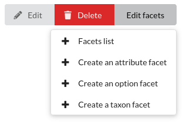
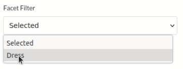
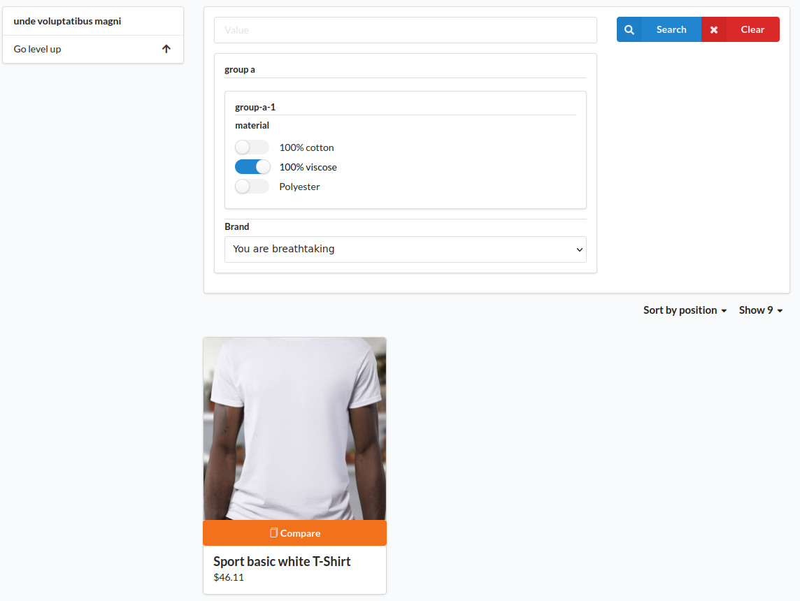

<p align="center">
</p>


<h1 align="center">Asdoria Facet Filter Bundle</h1>

<p align="center">
This plugin allows to to link facets to specific resources in your Sylius Shop

Sylius offers a system of products' attribute, options and some more. However, there's no native way to only use them on product from specific taxons(categories).
This may be a problem when/if you wish to let the user filter your catalog by using these facets.
Our plugin allows you to link specific attributes, options and other facets to specific taxons. This way, you can easily decide which filters to display and where

[//]: # (Sylius a une notion d'attributs de produits, d'options de produits et autres.)

[//]: # (Cependant, il n'y a pas de moyen intégré pour rendre ces attributs, options, taxons uniquement pertinents pour les produits dans des catégories spécifiques.)

[//]: # (Cela peut être un problème si/quand vous voulez permettre aux visiteurs de filtrer le catalogue de produits en utilisant ces facettes. )

[//]: # (Ce plugin permet de lier des attributs spécifiques, des options et d'autres facettes à des taxons u autre ressoures, ce qui vous permet de décider plus facilement quels filtres afficher à quel endroit.)
</p>

## Features

+ Create groups of facets
+ Create customizable facet filters tied to specific products' characteristics
+ Easily create facet collections
+ Attach the facet filters to your taxons or other resources

<div style="max-width: 75%; height: auto; margin: auto">


</div>

## Installation

---
1. run `composer require asdoria/sylius-facet-filter-plugin`


2. Add the bundle in `config/bundles.php`. You must put it ABOVE `SyliusGridBundle`

```php
Asdoria\SyliusFacetFilterPlugin\AsdoriaSyliusFacetFilterPlugin::class => ['all' => true],
[...]
Sylius\Bundle\GridBundle\SyliusGridBundle::class => ['all' => true],
```

3. Import routes in `config/routes.yaml`

```yaml
asdoria_facet_filter:
    resource: "@AsdoriaSyliusFacetFilterPlugin/Resources/config/routing.yaml"
    prefix: /admin
```


4. add the facets_filters filter into you grid config exemple for in `config/packages/grids/sylius_shop_product.yaml` but is already configure into the bundle for this grid
```yaml
sylius_grid:
    grids:
        sylius_shop_product:
            filters:
                facets_filters:
                    type: facets_filters
                    label: false
                    options:
                        owner: taxon
 #                      filterBy: owner | funnel
 # this option "filterBy" is optional but if you specify funnel, the different filters will be filled with the rest of the filtered products.
 # this option "filterBy" is optional but if you specify owner, the different filters will be filled with the list of attributes of the category.
 # This option "filterBy" is optional but if you don't specify it, the different filters will be filled with the list of attributes of all shops.
```

5. Import the plugin's config and add new config for `sylius.shop.product.index.search` event in `config/packages/_sylius.yaml`
```yaml
imports:
    - { resource: "@AsdoriaSyliusFacetFilterPlugin/Resources/config/config.yaml"}
...
sylius_ui:
    events:
        sylius.shop.product.index.search:
            blocks:
                search:
                    template: "@SyliusUi/Block/_legacySonataEvent.html.twig"
                    priority: 30
                    context:
                        event: sylius.shop.product.index.disabled_search
```

6. Implement the Facet Interface and Trait in your Taxon Entity `App/Entity/Taxonomy/Taxon.php`.

```php
// ...

use Asdoria\SyliusFacetFilterPlugin\Model\Aware\FacetFilterCodeAwareInterface;
use Asdoria\SyliusFacetFilterPlugin\Traits\FacetFilterCodeTrait;
use Doctrine\ORM\Mapping as ORM;
use Sylius\Component\Core\Model\Taxon as BaseTaxon;
use Sylius\Component\Taxonomy\Model\TaxonTranslationInterface;

/**
 * @ORM\Entity
 * @ORM\Table(name="sylius_taxon")
 */
class Taxon extends BaseTaxon implements FacetFilterCodeAwareInterface
{
    use FacetFilterCodeTrait;

    protected function createTranslation(): TaxonTranslationInterface
    {
        return new TaxonTranslation();
    }
}
```
7. Override or create if not already existing the Taxon Form template in `templates/bundles/SyliusAdminBundle/Taxon/_form.html.twig`.

```twig



<div class="ui segment">
    {{ form_errors(form) }}
    <div class="three fields">
        {{ form_row(form.code) }}
        {{ form_row(form.parent) }}
        {{ form_row(form.facetFilterCode) }}
    </div>
    <div class="fields">
        {{ form_row(form.enabled) }}
    </div>
</div>
{{ translationFormWithSlug(form.translations, '@SyliusAdmin/Taxon/_slugField.html.twig', taxon) }}



```
8. Override or create if not already existing the Product Index template in `templates/bundles/SyliusShopBundle/Product/index.html.twig`
```twig




<div class="ui stackable grid">
    <div class="four wide column">
        
        <div class="ui fluid vertical menu"></div>
        <div class="ui fluid vertical menu"></div>
        
    </div>
    <div class="twelve wide column">
        
    </div>
</div>

```

9. run `php bin/console do:mi:mi` to update the database schema

10. Finally, add translations to `config/packages/translation.yaml` :
```
framework:
    default_locale: '%locale%'
    translator:
        paths:
            - '%kernel.project_dir%/translations'
        fallbacks:
            - '%locale%'
            - 'en'
```

## Demo

You can see the result for the user here with caps: [here](https://demo-sylius.asdoria.fr/en_US/taxons/category/caps). <br>
If you want to try to create filters, go on [the admin authentication page](https://demo-sylius.asdoria.fr/admin/) and connect with:
> **Login:** asdoria <br>
> **Password:** asdoria

Then go on [facet filters page in back office](https://demo-sylius.asdoria.fr/admin/facet-filters/).

Note that we have developed several other open source plugins for Sylius, whose demos and documentation are listed on the [following page](https://asdoria.github.io/).

## Usage

1. In the back office, inside the `Configuration` section, go to `Facet Filters`.

2. Click on `Edit Groups` and `Create` buttons and create a new one. Fill the fields with a code that will identify your facet group. Of course, this will not be the name on the user side: you can specify a name in each language below in the form. Groups will help you organize your filters and group them when displaying on your site.

3. Once back on the previous page, click on `Configure children` linked to your new facet group. Fill the form in the same way as previously.

4. Return to the `Facet Filter` page, and click `Create` to initialize Filters targetting a specific Taxon. Inside the Code input, enter the code of a taxon you wish to create a filter for. This code can be found in the taxon's edit page at `{your-domain}/admin/taxons/{id}/edit` under Slug.

5. The interesting part begin here. Go on `Facet Filters` page, and click on `Edit facets` associated to your new filter. Several choices are available, let select `Create an attribute facet`. 

<div style="max-width: 75%; height: auto; margin: auto">



</div>

You can now fill the form with some cool things such as:
+ attribute to filter
+ segment, which represent the filter's group.
Obviously, you can change the facet's name for each language to adapt your content by country.

6. Go on the "Taxons" admin page and click on the three grey dots next to each other linked to the category of products you want to filter. Then, click on "Edit" button.

<div style="max-width: 75%; height: auto; margin: auto">


</div>

You can choose the facet filter to be used on your products.

<div style="max-width: 75%; height: auto; margin: auto">



</div>

7. Finally, see the results on the user side of your shop!
<div style="max-width: 75%; height: auto; margin: auto">



</div>
